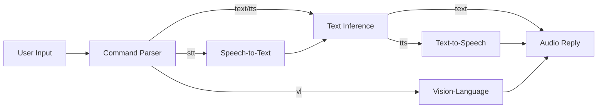

# Discord LLM ChatBot

An advanced Discord chatbot with memory, web search, file processing, vision capabilities, and AI-powered responses using Ollama or OpenAI as the backend.

## Features

### 🔍 **Enhanced Observability & Performance** (NEW)
- **Dual-Sink Logging**: Rich console output + structured JSON logs
- **Startup Orchestrator**: 3-5s faster parallel startup with dependency management
- **Health Monitoring**: Liveness/readiness checks with degraded mode detection
- **Background Task Watchdogs**: Heartbeat monitoring with automatic restarts
- **Resource Monitoring**: RSS memory, CPU, event loop lag tracking with threshold alerts
- **Prometheus Metrics**: Optional metrics collection (disabled by default)
- **Configuration Validation**: Fail-fast validation with detailed diagnostics

### 🎯 **Core Features**

- **Multi-modal AI Chat**: Support for text, voice, and image inputs
- **Text-to-Speech (TTS)**: Convert AI responses to voice messages
- **Speech-to-Text (STT)**: Process voice messages and convert to text with advanced preprocessing
- **Image Analysis**: Analyze and describe uploaded images
- **Conversation Context**: Maintain conversation history and context
- **Retrieval Augmented Generation (RAG)**: Advanced knowledge base search with vector embeddings
- **Hybrid Search**: Combines vector similarity search with keyword fallback
- **Knowledge Base Management**: Automatic ingestion and versioning of documentation files
- **Flexible AI Backend**: Support for multiple AI providers (OpenAI, Anthropic, etc.)
- **Discord Integration**: Native Discord bot with slash commands and message handling
- **Comprehensive Logging**: Detailed debugging logs
- **Automatic Memory Extraction**: Learns from conversations

## 🎛️ Command Usage

In Direct Messages (DMs), commands start with `!`. In servers (Guilds), commands must start by mentioning the bot, e.g., `@BotName !command`.

### Core Commands
- `!chat <prompt>`: Get a standard text-based response from the AI.
- `!say <text>`: The bot will speak the provided text in a voice note.
- `!speak`: Toggles your responses to be voice notes until you use the command again.
- `!tts [on|off]`: Enables or disables TTS responses for your user account.
- `!ping`: Checks if the bot is online and responsive.

### Vision
- `!see <prompt>` - Analyze attached image

### Hybrid Processing


## 🚀 Quick Start

### Prerequisites

- Python 3.11+
- Discord Bot Token ([Get one here](https://discord.com/developers/applications))
- (For local models) Ollama installed and running ([Installation Guide](https://ollama.com/))
- (For OpenAI/OpenRouter) API key

### Observability Configuration

### Environment Variables

```bash
# ===== OBSERVABILITY SETTINGS =====
# Enable Prometheus metrics (optional, default: false)
OBS_ENABLE_PROMETHEUS=false
PROMETHEUS_PORT=8001
PROMETHEUS_HTTP_SERVER=true

# Enable parallel startup orchestrator (3-5s improvement)
OBS_PARALLEL_STARTUP=false

# Health and resource monitoring (recommended: true)
OBS_ENABLE_HEALTHCHECKS=true
OBS_ENABLE_RESOURCE_METRICS=true

# Resource monitoring thresholds
RESOURCE_MEMORY_WARNING_MB=1024
RESOURCE_MEMORY_CRITICAL_MB=2048
RESOURCE_EVENT_LOOP_LAG_WARNING_MS=100
RESOURCE_EVENT_LOOP_LAG_CRITICAL_MS=500
RESOURCE_CPU_WARNING_PERCENT=80
RESOURCE_CPU_CRITICAL_PERCENT=95
```

### Health Check Endpoints

The bot provides health monitoring through the observability system:

- **Liveness**: Process responsive, event loop healthy
- **Readiness**: All components initialized and ready
- **Degraded Mode**: System running but with reduced functionality

Access comprehensive health status via the `get_comprehensive_health_status()` method.

## Installation

1. Clone the repository:
   ```bash
   git clone https://github.com/yourusername/discord-llm-chatbot.git
   cd discord-llm-chatbot
   ```

2. Create a `.env` file based on the example:
   ```bash
   cp .env.example .env
   ```
   Edit the `.env` file with your configuration

3. Set up the environment and install dependencies:
   ```bash
   # Option 1: Quick setup with fix_deps.sh (recommended)
   chmod +x scripts/fix_deps.sh
   ./scripts/fix_deps.sh
   
   # Option 2: Manual setup
   # Create a Python 3.11 virtual environment using uv
   python -m venv .venv
   source .venv/bin/activate  # On Windows: .venv\Scripts\activate
   
   # Install locked dependencies
   uv pip install -r requirements.txt

# For Prometheus metrics (optional)
pip install prometheus-client==0.22.1

# For enhanced resource monitoring 
pip install psutil>=5.8.0

   uv pip install --no-deps -e .
   
   # Run the bot
   uv run python -m bot.main
   ```
   
   For development and testing:
   ```bash
   # Run tests with pytest
   python -m pytest tests/ -o addopts=  # Override default pytest options
   
   # Run specific test
   python -m pytest tests/test_tts_assets.py::TestTTSAssets::test_validate_voice_bin -v -o addopts=
   ```

## 🛠️ Configuration

### Environment Variables

| Variable | Description | Required | Default |
|----------|-------------|----------|---------|
| `DISCORD_TOKEN` | Discord bot token | ✅ | - |
| `TEXT_BACKEND` | Backend for text generation (`openai` or `ollama`) | ❌ | `openai` |
| `OPENAI_API_KEY` | API key for OpenAI/OpenRouter | ❌ | - |
| `OPENAI_API_BASE` | Base URL for API | ❌ | `https://openrouter.ai/api/v1` |
| `SCREENSHOT_API_KEY` | API key for screenshotmachine.com | ❌ | - |
| `OPENAI_TEXT_MODEL` | Text model for chat | ❌ | `qwen/qwen3-235b-a22b:free` |
| `VL_MODEL` | Vision model for images | ❌ | `qwen/qwen2.5-vl-72b-instruct:free` |
| `OLLAMA_BASE_URL` | URL to Ollama server | ❌ | `http://localhost:11434` |
| `TEXT_MODEL` | Ollama text model | ❌ | `qwen3-235b-a22b` |
| `TEMPERATURE` | AI response creativity | ❌ | `0.7` |
| `TIMEOUT` | Response timeout (seconds) | ❌ | `120.0` |
| `CHANGE_NICKNAME` | Allow bot to change nickname | ❌ | `True` |
| `MAX_CONVERSATION_LENGTH` | Max conversation context | ❌ | `50` |
| `MAX_TEXT_ATTACHMENT_SIZE` | Max text file size (chars) | ❌ | `20000` |
| `MAX_FILE_SIZE` | Max attachment size (bytes) | ❌ | `2097152` |
| `PROMPT_FILE` | System prompt file | ❌ | `prompts/prompt-pry-super-chill-v2.txt` |
| `MAX_USER_MEMORY` | Max memories per user | ❌ | `1000` |
| `MEMORY_SAVE_INTERVAL` | Memory save interval (sec) | ❌ | `30` |
| `CONTEXT_FILE_PATH` | Path to context storage file | ❌ | `context.json` |
| `MAX_CONTEXT_MESSAGES` | Max messages per context | ❌ | `10` |
| `IN_MEMORY_CONTEXT_ONLY` | Disable all file-based context | ❌ | `false` |

| `RAG_EAGER_VECTOR_LOAD` | Eagerly load RAG vector index on startup (legacy behavior) | ❌ | `true` |
| `RAG_BACKGROUND_INDEXING` | Enable asynchronous background document indexing | ❌ | `true` |
| `RAG_INDEXING_QUEUE_SIZE` | Max pending indexing tasks in queue | ❌ | `256` |
| `RAG_INDEXING_WORKERS` | Number of concurrent indexing workers | ❌ | `2` |
| `RAG_INDEXING_BATCH_SIZE` | Number of docs per indexing batch/flush | ❌ | `32` |
| `RAG_LAZY_LOAD_TIMEOUT` | Seconds to wait in search path for lazy load (0 = non-blocking) | ❌ | `0.0` |

## 🤖 Commands

### User Commands
- `!reset` - Reset conversation context
- `!show-memories` - View your memories
- `!remember <text>` - Add a memory
- `!preference <key> <value>` - Set personal preference
- `!forget [@user]` - Forget memories (admin can target others)
- `!search <query>` - Web search
- `!extract-memories [limit]` - Extract memories from recent messages

### Admin Commands
- `!servermemories` - View server memories
- `!clearservermemories` - Clear server memories

### Special Features
- **Image Inference**: Attach image + prompt for VL model response
- **File Processing**: Attach text files for summarization/analysis
- **Auto Web Search**: Fact-based queries trigger automatic searches

## 🏗️ Project Structure
```
.
├── bot/               # Core bot functionality
│   ├── commands/      # Command handlers
│   ├── ai_backend.py  # AI model interactions
│   ├── config.py      # Configuration loading
│   ├── context.py     # Conversation context
│   ├── events.py      # Discord event handlers
│   ├── logs.py        # Logging setup
│   ├── main.py        # Entry point
│   ├── memory.py      # Memory management
│   ├── ollama.py      # Ollama backend
│   ├── openai_backend.py # OpenAI backend
│   ├── pdf_utils.py   # PDF processing
│   ├── router.py      # Message routing and dispatch
│   ├── search.py      # Web search
│   ├── stt.py         # Speech-to-text
│   ├── tasks.py       # Background tasks
│   ├── tts.py         # Text-to-speech
│   ├── utils.py       # Utilities
│   └── web.py         # Web content extraction
├── dm_logs/           # DM conversation logs
├── examples/          # Usage examples
├── kb/                # Knowledge base
├── logs/              # Application logs
├── prompts/           # System prompts
├── server_profiles/   # Server-specific data
├── tests/             # Test cases
├── user_logs/         # User message logs
└── user_profiles/     # User memory profiles
```

## 📚 Documentation

### Memory System
- **User Memory**: Personal memories/preferences stored in `user_profiles/`
- **Server Memory**: Shared memories in `server_profiles/`
- **Automatic Extraction**: Bot learns facts from conversations
- **Persistent Storage**: JSON files preserve memories between sessions

### Vision System
- Uses VL models for image understanding
- Automatic processing of image attachments
- Supports multiple VL models (Qwen-VL, LLaVA, GPT-4V)

### Search System
- DuckDuckGo integration for factual queries
- Automatic triggering for "who/what/when" questions
- Results integrated into AI responses

### RAG Subsystem (Lazy Load + Background Indexing)
- Immediate replies: The bot never blocks responses while the vector index is loading. A keyword fallback is used until the vector index is ready.
- Lazy vector index loading: Controlled by `RAG_EAGER_VECTOR_LOAD` (default `true` to preserve legacy). When set to `false`, the index loads on first query in a background task.
- Background indexing: When `RAG_BACKGROUND_INDEXING` is `true` (default), new documents are enqueued to an async queue processed by workers (`RAG_INDEXING_WORKERS`) with backpressure (`RAG_INDEXING_QUEUE_SIZE`).
- Observability: Structured logs and metrics track lazy load start/success/failure, queue events, and search completions. The system adheres to the 1 IN → 1 OUT rule.
- Tunables: `RAG_INDEXING_BATCH_SIZE` controls batching; `RAG_LAZY_LOAD_TIMEOUT` keeps the reply path non-blocking when set to `0.0`.

### TTS/STT System
- DIA TTS for text-to-speech
- Speech recognition for voice messages
- Per-user TTS preferences

## 🤝 Contributing
1. Fork the repository
2. Create a feature branch (`git checkout -b feature/AmazingFeature`)
3. Commit changes (`git commit -m 'Add feature'`)
4. Push to branch (`git push origin feature/AmazingFeature`)
5. Open a Pull Request

## 📜 License
MIT License - see [LICENSE](LICENSE) for details

## 🙏 Acknowledgments
- [Ollama](https://ollama.com/) for local LLM framework
- [Discord.py](https://github.com/Rapptz/discord.py) for Discord API
- [OpenRouter](https://openrouter.ai/) for model access
- [Kokoro-ONNX TTS](https://github.com/Oleg-Yarosh/kokoro-onnx) for TTS functionality

## ⚠️ Privacy & Security: Context Storage
To maintain conversational context, this bot stores recent messages. By default, it operates in a hybrid privacy mode:

- **Direct Messages (DMs)**: All DM conversations are stored **in-memory only** and are **never** written to disk. This history is ephemeral and will be lost on restart.
- **Guild/Server Channels**: Conversation history from public channels is saved to `context.json` to persist across restarts. This file is included in `.gitignore`.

**Security Recommendation**: For production environments, it is highly recommended to set restrictive file permissions for the context file (e.g., `chmod 600 context.json`) to protect its contents.

To disable all file-based context storage and run the bot in a fully ephemeral, in-memory mode, set the following environment variable:
```
IN_MEMORY_CONTEXT_ONLY=true
```
