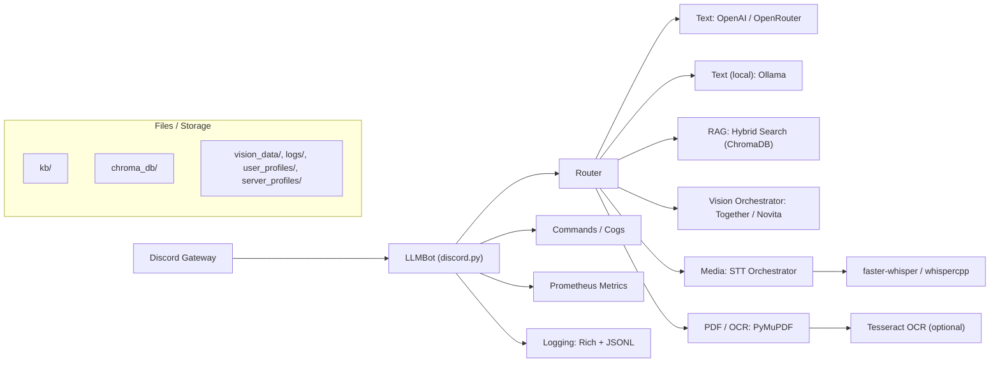

# discord-llm-chatbot

[](pyproject.toml)
[](LICENSE)

**Production-ready Discord bot** that blends chat, search/RAG, and multimodal (vision, OCR, TTS/STT). Built on `discord.py 2.x` with robust routing, retries, structured logs, and optional Prometheus metrics.

> Text via OpenAI/OpenRouter **or** local Ollama. RAG via ChromaDB. Vision via Together/Novita. STT via faster-whisper/whispercpp. OCR via PyMuPDF + Tesseract.

---

## ✨ Features

* **Chat & Tools**
  * General chat, search, screenshots, memory, admin/config.
  * Hybrid RAG (vector + keyword) over a local KB.
* **Media**
  * Video → **STT** (yt-dlp + faster-whisper), PDF/Images → **OCR**.
  * X/Twitter URL extraction with smart routing (VL vs STT vs web text).
* **Vision**
  * Image/video generation with provider budgeting, retries, and artifacts.
* **Ops**
  * Dual sinks: pretty console + **JSONL** (`logs/bot.jsonl`) with secret scrubbing.
  * Graceful shutdown, backoff/retries, health logs.
  * **Prometheus** (optional) for metrics.

---

## 🧭 Architecture (high-level)



Entrypoint: `run.py` → `bot.main:run_bot()` → `LLMBot.start()`
Commands autoload in `LLMBot.setup_hook()`; vision slash commands via `discord.app_commands`.
Config is `.env`-driven; prompt files loaded from disk.

---

## 🚀 5-Minute Quickstart

### 1) Create the bot in Discord

* In **Developer Portal**: create an app → add **Bot**.
* Enable **Message Content Intent** (and others if you use them).
* Note the **TOKEN** and **CLIENT_ID**.

**Invite URL** (replace placeholders):

```
https://discord.com/api/oauth2/authorize?client_id=<CLIENT_ID>&scope=bot%20applications.commands&permissions=<PERMISSIONS_INT>
```

Minimal permissions: Send Messages, Embed Links, Attach Files, Read Message History.

### 2) Clone & create env

```bash
git clone https://github.com/privacydied/discord-llm-chatbot.git 
cd discord-llm-chatbot
cp .env.example .env
```

### 3) Install (choose one)

**uv (recommended)**

```bash
uv venv --python 3.11
source .venv/bin/activate
uv pip sync requirements.txt
```

**pip**

```bash
python -m venv .venv
source .venv/bin/activate
pip install -r requirements.txt -e .
```

### 4) Fill the minimum config

In `.env` set:

* `DISCORD_TOKEN=<token>`
* `PROMPT_FILE=prompts/prompt-yoroi-super-chill.txt`
* `VL_PROMPT_FILE=prompts/vl-prompt.txt`
* **Either** set OpenRouter/OpenAI: `OPENAI_API_KEY=...`
  **Or** local: `TEXT_BACKEND=ollama`, `OLLAMA_MODEL=llama3`

### 5) Run

```bash
uv run python -m bot.main
# first run may need: uv run playwright install chromium
```

**Smoke test**: bot responds in a server DM with `!help` (or one of the commands below).

---

## ⚙️ Configuration (core)

> Full set lives in [docs/ENV_VARS.md](docs/ENV_VARS.md), `.env.example`, and `bot/config.py`. Here are the essentials:

| Name                 | Required | Default                        | Example                 | Notes                                 |
| -------------------- | -------- | ------------------------------ | ----------------------- | ------------------------------------- |
| `DISCORD_TOKEN`      | ✅        | —                              | `A1B2...`               | Bot token                             |
| `BOT_PREFIX`         | ❌        | `!`                            | `!,?`                   | Comma-separated allowed               |
| `TEXT_BACKEND`       | ❌        | `openai`                       | `ollama`                | Text provider                         |
| `OPENAI_API_KEY`     | "Maybe"  | —                              | `sk-or-...`             | Needed for OpenAI/OpenRouter          |
| `OPENAI_API_BASE`    | ❌        | `https://openrouter.ai/api/v1` | custom                  | OpenRouter base                       |
| `OPENAI_TEXT_MODEL`  | ❌        | —                              | `deepseek/...`          | Model id when using OpenRouter/OpenAI |
| `OLLAMA_BASE_URL`    | ❌        | `http://localhost:11434`       | custom                  | Local Ollama                          |
| `OLLAMA_MODEL`       | ❌        | `llama3`                       | `qwen3`                 | Local model                           |
| `PROMPT_FILE`        | ✅        | —                              | `prompts/...`           | System prompt (text)                  |
| `VL_PROMPT_FILE`     | ✅        | —                              | `prompts/vl-prompt.txt` | Vision system prompt                  |
| `LOG_LEVEL`          | ❌        | `INFO`                         | `DEBUG`                 | Log verbosity                         |
| `LOG_JSONL_PATH`     | ❌        | `logs/bot.jsonl`               | custom                  | Structured logs                       |
| `PROMETHEUS_ENABLED` | ❌        | `true`                         | `false`                 | Metrics switch                        |
| `PROMETHEUS_PORT`    | ❌        | `8000`                         | `9100`                  | Metrics port                          |

**Feature-based prerequisites**

* **OCR/PDF**: Tesseract (`tesseract`, language packs), PyMuPDF, Poppler (`pdftoppm`).
* **Tier-B Web**: Playwright Chromium (auto-installed on first run or `uv run playwright install chromium`).
* **STT**: `ffmpeg` recommended for robust media handling.

---

### Twitter/X Thread Unroll (author self-replies)

- Enabled by default. Toggle off with `TWITTER_UNROLL_ENABLED=false`.
- Limits (env): `TWITTER_UNROLL_MAX_TWEETS` (default 30), `TWITTER_UNROLL_MAX_CHARS` (default 6000), `TWITTER_UNROLL_TIMEOUT_S` (default 15).
- Behavior: When a `x.com/twitter.com` status URL is shared, the bot collects the author’s self-reply chain (contiguous) and packages it as a single context block; on any failure, it silently falls back to existing single-tweet handling. Non-Twitter links unaffected.
- Validate manually:
  - Post a long author thread → bot replies with consolidated context (count shown as [i/N] lines).
  - Post a single tweet → behavior unchanged.
  - Interleaved replies by others → only author tweets included.
  - Toggle `TWITTER_UNROLL_ENABLED=false` → identical to prior behavior.

---

## 🧰 Usage

**Message commands (examples)**

* Image generation: `!img <prompt>` (alias `!image`)
* Search: `!search <query>`
* Screenshot: `!ss <url>`
* Video transcription: `!watch <url>` (aliases `!transcribe`, `!listen`)
* TTS and speech: `!tts <text>` / `!tts on|off` / `!say <text>` / `!speak <text>`
* Memory: `!memory add <content>`, `!memory list`, `!memory clear`
* Context & privacy: `!context_reset`, `!context_stats`, `!privacy_optout`, `!privacy_optin`
* Admin/Config: `!reload-config`, `!config-status`, `!alert`, `!rag <subcommand>`

**Slash (vision)**

* `/image`, `/imgedit`, `/video`, `/vidref` (enable `VISION_ENABLED=true` and provider key(s)).

---

## 📈 Observability

* **Logs (two sinks)**
  * Pretty console (Rich)
  * JSONL file: `logs/bot.jsonl` (keys: ts, level, name, subsys, guild_id, user_id, msg_id, event, detail)
  * Secrets scrubbed by default filter.
* **Metrics**
  * Enable with `PROMETHEUS_ENABLED=true`, port via `PROMETHEUS_PORT`.

---

## 🧪 Troubleshooting (quick)

* **Slash commands not visible** → Re-invite with `applications.commands` scope; give it a few minutes or test in a specific guild.
* **"Missing intents"** → Enable **Message Content Intent** in the Developer Portal.
* **Playwright errors** → `uv run playwright install chromium`; install system deps if prompted.
* **OCR errors** → Ensure `tesseract` + language packs and `pdftoppm` are installed.
* **Ollama not found** → Start Ollama locally and confirm `OLLAMA_BASE_URL`.

---

## 🤝 Contributing

* Keep functions tidy, add tests where practical (`pytest`, `pytest-asyncio`).
* Don’t log secrets; keep the two logging handlers intact.
* Update `.env.example` and docs when adding features.
* In PRs, note risks, new envs, and any schema changes.

---

## 🔒 Security & Privacy

* Never commit secrets; use `.env` locally, secret stores in prod.
* Message Content Intent processes user content; ensure policy compliance.
* Restrict permissions on prompt/context files.
* JSONL logs scrub common secrets.

---

## 📄 License

MIT — see [LICENSE](LICENSE).
