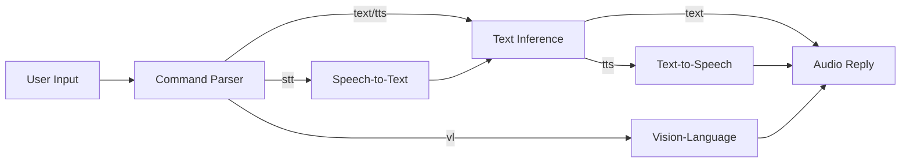

# Discord LLM ChatBot

An advanced Discord chatbot with memory, web search, file processing, vision capabilities, and AI-powered responses using Ollama or OpenAI as the backend.

## ✨ Features

- **Multimodal AI**: Hybrid text/speech/vision processing pipeline
- **Brain/Speak/See/Hear**: Centralized inference modules
- **Persistent Memory**: Remembers context and user preferences
- **Web Search**: Integrated web search for up-to-date information
- **File Processing**: Read and process text files and PDFs
- **Modular Architecture**: Clean, organized codebase
- **User Profiles**: Per-user settings and memory storage
- **Comprehensive Logging**: Detailed debugging logs
- **Automatic Memory Extraction**: Learns from conversations

## 🎛️ Command Usage

### Text and Voice
- `!ask <prompt> [--mode=text|tts|both]` - AI response (text/audio/both)
- `!speak <text>` - Convert text to speech
- `!hear` - Transcribe audio attachment

### Vision
- `!see <prompt>` - Analyze attached image

### Hybrid Processing


## 🚀 Quick Start

### Prerequisites

- Python 3.11+
- Discord Bot Token ([Get one here](https://discord.com/developers/applications))
- (For local models) Ollama installed and running ([Installation Guide](https://ollama.com/))
- (For OpenAI/OpenRouter) API key

### Installation

1. Clone the repository:
   ```bash
   git clone https://github.com/yourusername/discord-llm-chatbot.git
   cd discord-llm-chatbot
   ```

2. Create a `.env` file based on the example:
   ```bash
   cp .env-sample .env
   ```
   Edit the `.env` file with your configuration

3. Create a virtual environment and activate it:
   ```bash
   uv venv --python 3.11
   source venv/bin/activate  # On Windows: venv\Scripts\activate
   uv pip install -r requirements.txt
   python -m bot.main
   ```

## 🛠️ Configuration

### Environment Variables

| Variable | Description | Required | Default |
|----------|-------------|----------|---------|
| `DISCORD_TOKEN` | Discord bot token | ✅ | - |
| `TEXT_BACKEND` | Backend for text generation (`openai` or `ollama`) | ❌ | `openai` |
| `OPENAI_API_KEY` | API key for OpenAI/OpenRouter | ❌ | - |
| `OPENAI_API_BASE` | Base URL for API | ❌ | `https://openrouter.ai/api/v1` |
| `OPENAI_TEXT_MODEL` | Text model for chat | ❌ | `qwen/qwen3-235b-a22b:free` |
| `VL_MODEL` | Vision model for images | ❌ | `qwen/qwen2.5-vl-72b-instruct:free` |
| `OLLAMA_BASE_URL` | URL to Ollama server | ❌ | `http://localhost:11434` |
| `TEXT_MODEL` | Ollama text model | ❌ | `qwen3-235b-a22b` |
| `TEMPERATURE` | AI response creativity | ❌ | `0.7` |
| `TIMEOUT` | Response timeout (seconds) | ❌ | `120.0` |
| `CHANGE_NICKNAME` | Allow bot to change nickname | ❌ | `True` |
| `MAX_CONVERSATION_LENGTH` | Max conversation context | ❌ | `50` |
| `MAX_TEXT_ATTACHMENT_SIZE` | Max text file size (chars) | ❌ | `20000` |
| `MAX_FILE_SIZE` | Max attachment size (bytes) | ❌ | `2097152` |
| `PROMPT_FILE` | System prompt file | ❌ | `prompts/prompt-pry-super-chill-v2.txt` |
| `MAX_USER_MEMORY` | Max memories per user | ❌ | `1000` |
| `MEMORY_SAVE_INTERVAL` | Memory save interval (sec) | ❌ | `30` |

## 🤖 Commands

### User Commands
- `!reset` - Reset conversation context
- `!show-memories` - View your memories
- `!remember <text>` - Add a memory
- `!preference <key> <value>` - Set personal preference
- `!forget [@user]` - Forget memories (admin can target others)
- `!search <query>` - Web search
- `!extract-memories [limit]` - Extract memories from recent messages

### Admin Commands
- `!servermemories` - View server memories
- `!clearservermemories` - Clear server memories

### Special Features
- **Image Inference**: Attach image + prompt for VL model response
- **File Processing**: Attach text files for summarization/analysis
- **Auto Web Search**: Fact-based queries trigger automatic searches

## 🏗️ Project Structure
```
.
├── bot/               # Core bot functionality
│   ├── commands/      # Command handlers
│   ├── ai_backend.py  # AI model interactions
│   ├── config.py      # Configuration loading
│   ├── context.py     # Conversation context
│   ├── events.py      # Discord event handlers
│   ├── logs.py        # Logging setup
│   ├── main.py        # Entry point
│   ├── memory.py      # Memory management
│   ├── ollama.py      # Ollama backend
│   ├── openai_backend.py # OpenAI backend
│   ├── pdf_utils.py   # PDF processing
│   ├── search.py      # Web search
│   ├── stt.py         # Speech-to-text
│   ├── tasks.py       # Background tasks
│   ├── tts.py         # Text-to-speech
│   ├── utils.py       # Utilities
│   └── web.py         # Web content extraction
├── dm_logs/           # DM conversation logs
├── examples/          # Usage examples
├── kb/                # Knowledge base
├── logs/              # Application logs
├── prompts/           # System prompts
├── server_profiles/   # Server-specific data
├── tests/             # Test cases
├── user_logs/         # User message logs
└── user_profiles/     # User memory profiles
```

## 📚 Documentation

### Memory System
- **User Memory**: Personal memories/preferences stored in `user_profiles/`
- **Server Memory**: Shared memories in `server_profiles/`
- **Automatic Extraction**: Bot learns facts from conversations
- **Persistent Storage**: JSON files preserve memories between sessions

### Vision System
- Uses VL models for image understanding
- Automatic processing of image attachments
- Supports multiple VL models (Qwen-VL, LLaVA, GPT-4V)

### Search System
- DuckDuckGo integration for factual queries
- Automatic triggering for "who/what/when" questions
- Results integrated into AI responses

### TTS/STT System
- DIA TTS for text-to-speech
- Speech recognition for voice messages
- Per-user TTS preferences

## 🤝 Contributing
1. Fork the repository
2. Create a feature branch (`git checkout -b feature/AmazingFeature`)
3. Commit changes (`git commit -m 'Add feature'`)
4. Push to branch (`git push origin feature/AmazingFeature`)
5. Open a Pull Request

## 📜 License
MIT License - see [LICENSE](LICENSE) for details

## 🙏 Acknowledgments
- [Ollama](https://ollama.com/) for local LLM framework
- [Discord.py](https://github.com/Rapptz/discord.py) for Discord API
- [OpenRouter](https://openrouter.ai/) for model access
- [DIA TTS](https://github.com/diart-team/dia-tts) for TTS functionality
