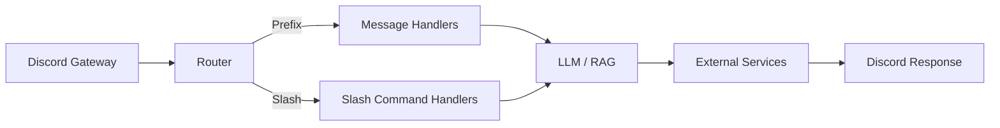

# Architecture

> **Fill me in**
> - [ ] Verify component names and paths.
> - [ ] Expand on external service details.

## Overview
The bot is built on `discord.py` 2.x and structured for reliability and observability.

- **Gateway client**: manages Discord connection and event dispatch.
- **Router**: delegates messages and interactions to handlers.
- **Commands/Cogs**: discrete modules under `bot/commands` for chat, RAG, vision, and admin tasks.
- **Schedulers**: background tasks for indexing and cleanup.
- **Persistence**: local files and optional ChromaDB for RAG.
- **External services**: OpenAI/OpenRouter or Ollama for text, TTS/STT engines, and vision APIs.

## Message Lifecycle

## Rate Limiting & Sharding
- Uses `discord.py` internal rate limit handling.
- Add exponential backoff on HTTP errors.
- Sharding can be enabled via environment variable `SHARD_COUNT` (default 1).

## Error Handling & Observability
- Structured logging to console and JSONL files.
- Optional Prometheus metrics via an HTTP server.
- Exceptions are surfaced with contextual details; unrecoverable errors trigger graceful shutdown.

## Configuration Loading
- Reads variables from environment or `.env` using `dotenv`.
- Validates required keys at startup and fails fast on missing values.
