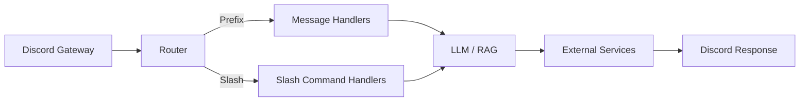

# Architecture

> Last updated: 2026-05-13 — decomposed router components, multimodal pipeline, TTS/STT engines.

## Overview
The bot is built on `discord.py` 2.x and structured for reliability and observability.

- **Gateway client**: manages Discord connection and event dispatch.
- **Router**: delegates messages and interactions to handlers.
- **Commands/Cogs**: discrete modules under `bot/commands` for chat, RAG, vision, and admin tasks.
- **Schedulers**: background tasks for indexing and cleanup.
- **Persistence**: local files and optional ChromaDB for RAG.
- **External services**: OpenAI/OpenRouter or Ollama for text, TTS/STT engines, and vision APIs.

## Message Lifecycle

```mermaid
flowchart LR
    GW["Discord Gateway"] --> RT[Router]
    RT -->|Prefix| MSG[Message Handlers]
    RT -->|Slash| SL[Slash Command Handlers]
    MSG --> LLM[LLM / RAG]
    SL --> LLM
    LLM --> EXT[External Services]
    EXT --> RESP[Discord Response]
```

## Rate Limiting & Sharding
- Uses `discord.py` internal rate limit handling.
- Add exponential backoff on HTTP errors.
- Sharding can be enabled via environment variable `SHARD_COUNT` (default 1).

## Error Handling & Observability
- Structured logging to console and JSONL files.
- Optional Prometheus metrics via an HTTP server.
- Exceptions are surfaced with contextual details; unrecoverable errors trigger graceful shutdown.

## Configuration Loading
- Reads variables from environment or `.env` using `dotenv`.
- Validates required keys at startup and fails fast on missing values.

---

## Router Component Contract

The router lives in `bot/router.py`. Processing logic extracted from the monolithic `Router` class is organized into `bot/router_components/`. Each component module exports plain functions that the `Router` imports and calls — there is no subclassing or interface implementation required to use the component layer.

### Dispatch entry point

All inbound messages enter through `Router.dispatch_message(message: Message) -> Optional[BotAction]`. This single method orchestrates:

1. Self/bot message filtering
2. Deduplication lock per message ID
3. Preflight feature gates
4. Command parsing and delegation
5. Should-process gating (`_should_process_message`)
6. Scope resolution (DM / thread / reply / guild)
7. Sequential multimodal input collection and processing
8. Response emission

The return type is `Optional[BotAction]` — a concrete `BotAction` means the router generated a response; `None` means the message was intentionally skipped (not addressed, gate denied, etc.).

### `can_handle` / `handle` protocol

Router sub-handlers follow a two-phase pattern. Not every helper uses an explicit `can_handle` method, but the conceptual contract holds across the codebase:

| Phase | Method signature | Constraints | Purpose |
|-------|-----------------|-------------|---------|
| **can_handle** | `def can_handle(...) -> bool` | **Synchronous**. No network calls. No blocking I/O. No asyncio. Must return quickly (< 1 ms typical). | Cheap predicate: check URL patterns, attachment types, content keywords, command strings, or config flags. |
| **handle** | `async def handle(...) -> BotAction \| ResponseMessage` | **Async only**. Must respect timeouts on all external calls. May perform network I/O, file downloads, LLM calls, STT, etc. | Performs the actual work once `can_handle` returned `True`. Returns a `BotAction` or `ResponseMessage` with content / embeds / files. |

The synchronous `can_handle`-style checks are spread across component functions in `bot/router_components/`:

- **`bot/router_components/gating.py`** — `mentions_bot()`, `is_reply_to_bot()`, `strip_leading_bot_mention()`
- **`bot/router_components/input_harvest.py`** — `is_direct_image_url()`, `is_text_attachment()`, `has_meaningful_text()`, `extract_urls_loose()`, etc.
- **`bot/router_components/x_routing.py`** — `is_twitter_status_url()`, `is_tweet_media_url()`, `is_twitter_media_cdn()`, etc.
- **`bot/router_components/prompt_access.py`** — `get_system_prompt()`

Async "handle" equivalents live as methods on `Router` (`_flow_process_text`, `_flow_process_url`, `_flow_process_audio`, `_flow_process_attachments_multimodal`, `_flow_generate_tts`) and in component functions such as `resolve_twitter_status_id()`, `resolve_and_probe_twitter_images()`, etc.

### Flow registry

The `Router` maintains an internal flow map (`self._flows`) binding string keys to async handler methods:

```
process_text      -> _flow_process_text
process_url       -> _flow_process_url
process_audio     -> _flow_process_audio
process_attachments -> _flow_process_attachments_multimodal
generate_tts      -> _flow_generate_tts
```

`_bind_flow_methods()` populates this map at init, accepting an optional `flow_overrides` dict for test injection. The flow map can be updated at runtime, enabling test scenarios and staged rollouts.

---

## First-Match-Wins Routing

The router uses a **first-match-wins** dispatch strategy. Handlers are evaluated in a fixed priority order; the first handler whose predicate succeeds owns the message, and no subsequent handlers are consulted.

The rough evaluation order in `dispatch_message()` is:

1. **Self/bot message filter** — drops messages authored by the bot or any bot user.
2. **Preflight feature gate** — checks per-server feature toggles (`is_server_feature_enabled`) before any routing logic. If a server has disabled a feature and the message uses it, a disable response is returned immediately.
3. **Legacy test compat path** — attachments-only messages with empty content (skipped in production mocks).
4. **Command routing** — `!cmd` and `<@bot> cmd` patterns. Recognized commands (`img`, `ping`, `help`, `tts`, `say`, `chat`, etc.) are either handled directly or delegated to cogs via `BotAction(meta={"delegated_to_cog": True})`.
5. **Should-process gate** — `_should_process_message()` determines if the bot should respond at all (mention, reply, DM, owner, thread rules). If denied, the message is dropped.
6. **Vision intent precheck** — `_prioritized_vision_route()` examines the message for text-to-image generation triggers before general multimodal processing.
7. **X/Twitter early resolve** — if `X_EARLY_RESOLVE_ENABLED` is `True` (default), X/Twitter URLs are detected and resolved ahead of the generic multimodal pipeline.
8. **General multimodal processing** — `_process_multimodal_message_internal()` sequentially processes all harvested input items (text, image URLs, video URLs, audio, documents).

Once a handler produces a non-`None` `BotAction` or `ResponseMessage`, the dispatch loop short-circuits and returns. There is no fallback cascade — the first matching handler has exclusive ownership.

---

## Mention-Gating Invariant

**Hard rule**: The bot must never reply to messages in guild channels unless explicitly addressed. DMs do not require a mention.

This invariant is enforced by `_should_process_message()` (`bot/router.py`, ~line 2503), which is the single source-of-truth gate. The logic is:

### Guild channels (default: mention required)

| Condition | Result |
|-----------|--------|
| Bot is mentioned (`<@BOT_ID>` or `<@!BOT_ID>`) | **Allow** |
| Message is a reply to a bot-authored message AND `ALLOW_REPLY_TO_BOT_WITHOUT_MENTION` is `True` | **Allow** |
| Direct vision trigger detected in content (even without mention) | **Allow** |
| Master switch `BOT_SPEAKS_ONLY_WHEN_SPOKEN_TO` is `False` | **Allow** (legacy mode) |
| None of the above | **Block** — message ignored silently |

### DM channels (default: no mention required)

| Condition | Result |
|-----------|--------|
| `DM_REQUIRE_MENTION` is `False` (default) | **Allow** all messages |
| `DM_REQUIRE_MENTION` is `True` AND bot is mentioned | **Allow** |
| `DM_REQUIRE_MENTION` is `True` AND message is a reply to bot AND `ALLOW_REPLY_TO_BOT_WITHOUT_MENTION` is `True` | **Allow** |
| `DM_REQUIRE_MENTION` is `True` and neither mention nor reply | **Block** |

### Key configuration flags

| Flag | Default | Effect |
|------|---------|--------|
| `BOT_SPEAKS_ONLY_WHEN_SPOKEN_TO` | `True` | Master switch. `False` disables all gating (allow everything). |
| `REQUIRE_MENTION_IN_GUILDS` | `True` | Requires `@bot` mention for guild messages. |
| `ALLOW_REPLY_TO_BOT_WITHOUT_MENTION` | `True` | Allows replying to the bot without an explicit mention. |
| `DM_REQUIRE_MENTION` | `False` | If `True`, DMs also require a mention. |

### Mention detection

Two implementations exist and both resolve to the same component function:

- **`Router._mentions_bot(message)`** — synchronous check using `mentions_bot()` from `router_components/gating.py`. Checks `message.mentions` against the bot's user ID. Supports both `<@id>` and `<@!id>` formats via the component's own fallback.
- **`Router._is_mentioned(message)`** — safety wrapper for mock and production messages. Uses `message.mentions` list membership check.

The `_should_process_message` gate is **sync, cheap, and side-effect-free** — it performs no network calls, no disk I/O, and no async operations.

---

## Feature Gates

Feature gates control subsystem availability at two levels: global (config flags) and per-server (server features).

### Global config flags (`*_ENABLED`)

These are read from the bot's config dict at startup and cached on the `Router` instance:

| Flag | Default | Controls |
|------|---------|----------|
| `VISION_ENABLED` | `True` | Vision / image analysis pipeline |
| `VISION_T2I_ENABLED` | `True` | Text-to-image generation via `!img` command |
| `VOICE_ENABLE_NATIVE` | `False` | Native Discord voice integration |
| `X_API_ENABLED` | `False` | Direct X/Twitter API access |
| `TWITTER_UNROLL_ENABLED` | `False` | Author thread unrolling on X/Twitter |
| `X_SYNDICATION_ENABLED` | `True` | Fxtwitter/vxtwitter syndication endpoint for tweet text |
| `X_EARLY_RESOLVE_ENABLED` | `True` | X/Twitter URL detection before general multimodal processing |
| `X_SYNDICATION_PROBE_ENABLED` | `True` | Image resolution / photo probing for syndicated tweets |

Runtime compatibility settings are loaded once via `load_router_runtime_compat(config)` from `bot/router_components/runtime.py`, producing a frozen `RouterRuntimeCompat` dataclass with fields:

- `syn_ttl_s` — syndication cache TTL (default 900s)
- `x_syn_probe_enabled` — image probe toggle
- `x_syn_order` — probe order string (default `"yt_dlp,html,api"`)
- `x_syn_timeout_s` — syndication request timeout (default 3.0s)
- `x_syn_max_images` — max images to probe per tweet (default 4)
- `x_syn_accept_domains` — allowed CDN domains set
- `x_early_resolve_enabled` — early X/Twitter route toggle

### Per-server feature toggles

The `is_server_feature_enabled(guild_id, feature)` function (from `bot/server_features.py`) resolves per-guild feature status. The `_feature_gate_response()` method checks this BEFORE any routing logic:

- `image_generation` — guarded when message uses `!img` command
- `vision` — guarded when message has image attachments
- `stt` — guarded when message has audio or video attachments
- `x_twitter_extraction` — guarded when message contains X/Twitter status URLs
- `web_extraction` — guarded when message contains other URLs

If a feature is disabled on the server, `_feature_gate_response` returns a `ResponseMessage` with a short disable notice, and dispatch short-circuits. Guild ID is `None` in DMs, so per-server gates are automatically skipped for DM messages.

---

## Input Harvesting / Prompt Access Patterns

### Multimodal input collection

After passing all gates, the router harvests all potential inputs from the message:

1. **Message content** — text with bot mention stripped via `strip_leading_bot_mention()` from `router_components/gating.py`.
2. **Attachments** — file URLs classified by `router_components/input_harvest.py`:
   - `is_direct_image_url()` — detects image extensions or image content-types.
   - `is_text_attachment()` — detects `.txt` and `text/*` MIME types.
   - `all_attachments_are_text()` — checks if every attachment is plain text (to skip legacy attachment path).
3. **URLs** — extracted from message content via `extract_urls_loose()` and `extract_urls_strict()`.
4. **Embed URLs** — `append_embed_related_urls()` collects related URLs from Discord embeds.
5. **X/Twitter candidates** — `collect_x_candidate_urls()` gathers X/Twitter URLs from content, embeds, and attachments via the `bot/router_components/x_routing.py` layer.

All harvested items are passed through `collect_input_items()` (from `bot/modality.py`) which assembles a list of `InputItem` dataclass instances, each tagged with an `InputModality` enum value. The router then processes items sequentially in `_process_multimodal_message_internal()`, feeding each result into the `_flow_process_text()` pipeline.

### Prompt access

System prompts are loaded through a unified accessor:

- **`get_system_prompt(bot, key, default)`** in `bot/router_components/prompt_access.py` — safely reads from `bot.system_prompts` dict, returning a fallback or `None` if the key is missing.
- **`Router._get_system_prompt(key, default)`** — instance method wrapping the component function with the bot reference bound.
- **VL prompt guidelines** — loaded eagerly at router init from `prompts/vl-prompt.txt` (if present) and stored in `self._vl_prompt_guidelines`.

---

## How to Add a New Handler

To add a new message handler that participates in the router's dispatch:

### 1. Write the component predicate (sync, cheap)

Create or extend a function in the appropriate `bot/router_components/` module:

```python
# bot/router_components/my_feature.py
def is_my_feature_content(content: str) -> bool:
    """Sync predicate: does the message content match my feature's pattern?"""
    return "MY_TRIGGER" in content
```

Constraints: **No network calls. No async. No blocking I/O.** Must return in < 1 ms.

### 2. Write the async handler

Add an async method to the `Router` class:

```python
# bot/router.py — inside the Router class
async def _flow_process_my_feature(self, message: Message) -> BotAction:
    """Handle messages matching my_feature predicate."""
    # ... async I/O: API calls, LLM, DB, etc. Always use timeouts ...
    return BotAction(response=ResponseMessage(content="done"))
```

### 3. Register the flow

In `Router._bind_flow_methods()`, add your flow:

```python
self._flows = {
    ...
    "process_my_feature": self._flow_process_my_feature,
}
```

### 4. Insert into dispatch order

In `dispatch_message()`, add your check at the appropriate priority level:

```python
# After command parsing, before multimodal processing
if is_my_feature_content(clean_content):
    self.logger.info("Routing to my_feature handler")
    return await self._flow_process_my_feature(message)
```

Or if you want a feature gate:

```python
# In _feature_gate_response(), add a check:
if is_server_feature_enabled(guild_id, "my_feature") is False and is_my_feature_content(content):
    return ResponseMessage(content="My feature is disabled on this server.")
```

### 5. Export from `__init__.py`

If you created a new component module, add the exports to `bot/router_components/__init__.py`:

```python
from .my_feature import is_my_feature_content
```

### Checklist

- [ ] Predicate is sync, no network/blocking I/O (`[PA]`)
- [ ] Handler is async with timeouts on all external calls (`[REH]`)
- [ ] Feature gate added if subsystem should be togglable per-server
- [ ] Flow registered in `_bind_flow_methods()`
- [ ] Check inserted at correct priority in `dispatch_message()`
- [ ] Exported from `router_components/__init__.py` (if new module)
- [ ] Logger events follow structured format: `extra={"event": "...", "msg_id": ...}`
- [ ] Input validation on all boundaries (`[IV]`)

---

## X/Twitter Routing Special Case

X/Twitter (formerly Twitter) message handling has a dedicated early-resolution path that operates **ahead of** the general multimodal pipeline. This is intentional: tweet resolution is complex and benefits from specialized handling.

### Detection

X/Twitter URLs are detected from:
- **Message content** — regex matching against `x.com`, `twitter.com`, `fxtwitter.com`, `vxtwitter.com`, `fixupx.com` hosts.
- **Message embeds** — Discord embeds from tweet URLs are checked via embed URL, author URL, and provider name.
- **Reply references** — resolved reference messages are scanned for tweet URLs.

### Early resolution path

When `X_EARLY_RESOLVE_ENABLED` is `True` (the default, loaded via `RouterRuntimeCompat.x_early_resolve_enabled`):

1. `_gather_prioritized_x_urls()` collects candidate URLs from the content layer, embed layer, and attachment layer.
2. URLs are normalized (`_canonicalize_x_url`, `_normalize_x_url`) to resolve `x.com` / `twitter.com` / `mobile.twitter.com` / `fx`/`vx` variant prefixes.
3. `_resolve_x_media()` attempts text extraction via multiple backends:
   - **X API** (`XApiClient.get_tweet_by_id()`) — primary source, requires `X_API_ENABLED=True`.
   - **Syndication endpoint** (`/i/communitytweet/{id}`) — fxtwitter syndication fallback, returns tweet text, media URLs, and metadata.
   - **fxtwitter tweet node extraction** — `extract_fxtwitter_tweet_node()` parses syndication response variants.
4. Resolution is time-boxed by `x_syn_timeout_s` (default 3.0s).
5. If the resolved content matches a special kind (e.g., `video`, `images`), the router may bypass general multimodal processing and handle the tweet directly.

### Syndication cache

The `Router` maintains an in-memory syndication cache (`self._syn_cache`) with TTL-based expiry (default 900s from `x_syn_ttl_s`). Per-tweet locks (`self._syn_locks`) prevent duplicate concurrent fetches for the same status ID.

### Video STT fallback

If a tweet contains video content and STT transcription fails, the router degrades to caption-only output:
- `_format_x_caption_only_fallback_result()` — returns the tweet text with a note that STT was unavailable.
- `_format_x_video_stt_error_result()` — returns the tweet text with the STT error detail.

This is logged via structured events: `stt.fail`, `fallback`, with breadcrumbs for observability.

### Visual facts

For tweets with images, the router can compose visual analysis facts from the vision pipeline into the response via `_compose_x_tweet_with_visual_facts()`, combining user text, tweet caption, and VL notes into a unified output.
