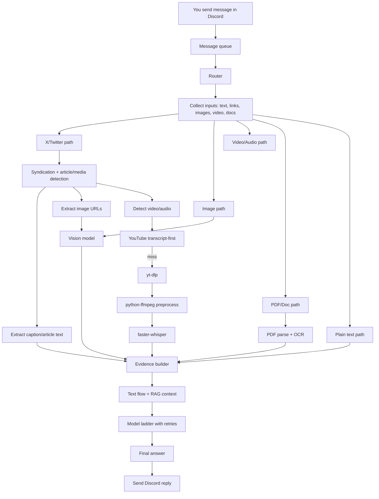

# How This Discord Bot Works (ELI5, But Detailed)

Imagine this bot is a smart mailroom inside a big office.
Every message is a package.
The bot has different desks for different package types:
- one desk reads text
- one desk looks at images
- one desk listens to audio/video
- one desk reads PDFs
- one desk understands X/Twitter links

The bot's job is not to be fancy. Its job is to be reliable:
1. sort correctly
2. extract useful facts
3. combine those facts
4. answer once, clearly

## The Big Picture

## Step-by-Step (Like You’re 5)

1. **Message arrives**
The bot puts your message in a queue so things stay orderly.
Think of this as "take a number and wait your turn" so requests do not collide.

2. **Router decides the path**
The router is traffic control. It checks: “Is this text? an X link? images? video? docs?”
It can also do mixed messages (for example: text + X link + image in one post).

3. **Each media type gets its own worker**
- **Images** go to vision.
- **Videos/audio** go to transcript flow.
- **Docs/PDFs** go to parser + OCR.
- **X links** go through syndication and article/media detection first.
This keeps logic modular: each worker does one job well.

4. **X/Twitter handling is special**
The bot tries to pull:
- tweet/article text (caption/body)
- image URLs (for vision)
- video/audio signals (for STT)

Why special? Because X links are usually "containers" that may include multiple modalities at once.
So the bot first asks: "What is inside this link?" then chooses the correct path.

5. **Video speech extraction**
For video/audio, the pipeline is:
`yt-dlp -> python-ffmpeg -> faster-whisper`

If it is YouTube, the bot first tries **transcript-first** (cheap + fast). If no transcript is available, it falls back to audio download + whisper.

What each part does:
- `yt-dlp`: fetches the media source (or metadata/transcript route)
- `python-ffmpeg`: converts audio into a whisper-friendly format
- `faster-whisper`: turns speech into text

This is important for resource control on NAS hardware: transcript-first can skip heavy decode work.

6. **Evidence is merged**
All extracted pieces are combined into one context block:
- tweet/article text
- image understanding
- audio transcript
- OCR text
- your original question

This is where important concat rules matter (for example, tweet caption + transcript together).
The bot does this so the final model sees the full story, not disconnected fragments.

7. **Text brain answers**
The final prompt goes into text generation with optional RAG context.
A fallback ladder handles provider/model failures and timeouts.

Fallback ladder means:
- try provider A
- if it fails (timeout/rate-limit/dead endpoint), try provider B
- if needed, try provider C

So the bot fails soft instead of failing hard.

8. **Reply sent back**
Bot returns one coherent response in Discord.
Even if one branch fails, the bot tries to return the best possible result from what it did collect.

## What Happens On Common Real-World Inputs

### Case 1: "Analyze this X video"
1. Router sees X URL.
2. X path resolves text/media hints.
3. Video path runs STT flow (`yt-dlp -> ffmpeg -> whisper`).
4. Caption + transcript are concatenated.
5. Text flow generates response from both.

### Case 2: "Analyze this X post with images"
1. Router sees X URL.
2. X path pulls tweet/article text + image URLs.
3. Vision describes image content.
4. Caption/article text is concatenated with VL evidence.
5. Text flow answers using both.

### Case 3: "Analyze this PDF screenshot + my question"
1. Router detects docs/images + user text.
2. OCR/parser extracts readable text.
3. Evidence builder merges OCR + user question.
4. Text flow replies with grounded answer.

## Why The Merge Step Is The Core

The merge step is the "team meeting" before final output.
If this step is weak, answers become shallow or miss context.
If this step is strong, the bot behaves like it understood everything you sent.

That is why concat invariants matter:
- X caption + transcript for videos
- X article/caption + VL facts for image posts
- OCR text + user intent for docs

## Why this design works

- **Fast when possible**: transcript-first avoids expensive decode work.
- **Safe fallback behavior**: if one provider fails, another can continue.
- **Multimodal by construction**: text, vision, OCR, and STT all feed one final reasoning step.
- **Better UX**: users can drop almost any content type and still get a useful answer.
- **Resource-aware**: heavy tasks are gated by budgets/timeouts so one request does not block the whole bot.
- **Debuggable**: structured logs make it obvious which stage succeeded or failed.

## One-sentence summary

This bot is a multimodal assembly line: route the input, extract evidence with the right tool, merge everything, then generate one grounded reply.
